# UniClubConnect - Mikroservis Mimarisi ve Teknik Tasarım Özellikleri

UniClubConnect, üniversite kulüpleri ve öğrencileri arasında sosyal etkileşim, etkinlik yönetimi, biletleme, gerçek zamanlı mesajlaşma, oyunlaştırma ve akış yönetimini sağlamak amacıyla geliştirilmiş **Spring Cloud** tabanlı, olay-odaklı (event-driven) ve yüksek performanslı bir mikroservis projesidir.

---

## 🏗️ Genel Sistem Mimarisi

Sistem; bağımsız olarak ölçeklenebilen 12 mikroservis, 3 altyapı bileşeni, bellek içi önbellek (Redis), mesaj kuyruğu (RabbitMQ), ilişkisel veritabanı (PostgreSQL), S3 nesne depolama (MinIO) ve test e-posta sunucusundan (Mailpit) oluşur.

```mermaid
graph TD
    Client[Web / Mobil İstemci] -->|HTTP / WebSocket| Gateway[API Gateway - Port 8080]
    
    subgraph Service Discovery & Configuration
        Eureka[Eureka Discovery Server - Port 8761] <-->|Register / Locate| Gateway
        Config[Central Config Server - Port 8888] <-->|Fetch Configs| Gateway
    end

    subgraph Microservices
        Auth[Auth Service - Port 9001]
        Profile[User Profile Service - Port 9002]
        Club[Club Service - Port 9003]
        Event[Event Service - Port 9004]
        Reg[Registration Service - Port 9005]
        Notif[Notification Service - Port 9006]
        Post[Post Service - Port 9007]
        Inter[Interaction Service - Port 9008]
        Follow[Follow Service - Port 9009]
        Feed[Feed Service - Port 9010]
        Gamif[Gamification Service - Port 9011]
        Chat[Chat Service - Port 9012]
    end

    Gateway -->|/api/auth/**| Auth
    Gateway -->|/api/profiles/**| Profile
    Gateway -->|/api/clubs/**| Club
    Gateway -->|/api/events/**| Event
    Gateway -->|/api/registrations/**| Reg
    Gateway -->|/api/posts/**| Post
    Gateway -->|/api/interactions/**| Inter
    Gateway -->|/api/follows/**| Follow
    Gateway -->|/api/feed/**| Feed
    Gateway -->|/api/gamification/**| Gamif
    Gateway -->|/api/chat/**, /ws/**| Chat

    subgraph Databases & Caching
        DB[(PostgreSQL uniclub_db)]
        Redis[(Redis Cache)]
    end

    subgraph Object Storage & Messaging
        Minio[(MinIO Object Storage)]
        Rabbit[RabbitMQ Message Broker]
        Mailpit[Mailpit Email Server]
    end

    %% Database schemas
    Auth -.->|auth_schema| DB
    Profile -.->|profile_schema| DB
    Club -.->|club_schema| DB
    Event -.->|event_schema| DB
    Reg -.->|registration_schema| DB
    Notif -.->|notification_schema| DB
    Post -.->|post_schema| DB
    Inter -.->|interaction_schema| DB
    Follow -.->|follow_schema| DB
    Gamif -.->|gamification_schema| DB
    Chat -.->|chat_schema| DB

    %% Redis Cache
    Reg -->|Quota check & decrement| Redis
    Event -->|Set quota| Redis
    Follow -->|Follower counts| Redis
    Feed -->|Cache timelines| Redis
    Chat -->|Online status presence| Redis

    %% MinIO uploads
    Profile -->|Upload profile images| Minio
    Club -->|Upload logos| Minio
    Event -->|Upload posters| Minio
    Post -->|Upload post images| Minio

    %% RabbitMQ
    Auth -->|Publish user.created| Rabbit
    Reg -->|Publish ticket.created| Rabbit
    Reg -->|Publish event.joined| Rabbit
    Follow -->|Publish follow.created| Rabbit
    Chat -->|Publish unread.message| Rabbit
    Post -->|Publish post.created / deleted| Rabbit
    Inter -->|Publish interaction event| Rabbit

    Rabbit -->|Consume events| Notif
    Rabbit -->|Consume user.created| Profile
    Rabbit -->|Consume post.created / deleted| Feed
    Rabbit -->|Consume gamification events| Gamif

    %% Mailpit
    Notif -->|Send SMTP| Mailpit
```



---

## 🛠️ Servis Kataloğu ve Port Referans Tablosu

| Modül / Servis Adı | Port | DB Şeması | API Route Prefix | Açıklama |
| :--- | :---: | :--- | :--- | :--- |
| **Eureka Server** | `8761` | Yok | Yok | Servis keşif ve kayıt sunucusu (Service Discovery). |
| **Config Server** | `8888` | Yok | Yok | Merkezi git konfigürasyon sunucusu (Central Config). |
| **API Gateway** | `8080` | Yok | `/api/**`, `/ws/**` | İstek yönlendirme, CORS çözme ve güvenlik geçidi. |
| **Auth Service** | `9001` | `auth_schema` | `/api/auth/**`, `/api/requests/**`, `/api/admin/**` | JWT tabanlı Kimlik Doğrulama, rol yükseltme ve üye yetkilendirmesi. |
| **User Profile Service** | `9002` | `profile_schema` | `/api/profiles/**` | Kullanıcı profili saklama, arama ve MinIO resim yükleme. |
| **Club Service** | `9003` | `club_schema` | `/api/clubs/**` | Öğrenci kulüpleri oluşturma, logoları yönetme ve üyelik onaylama. |
| **Event Service** | `9004` | `event_schema` | `/api/events/**` | Kulüp etkinlikleri, afiş yönetimi ve Redis kontenjan kontrolü. |
| **Registration Service** | `9005` | `registration_schema` | `/api/registrations/**` | Etkinlik bilet alımı, iptal ve kapıda QR doğrulaması. |
| **Notification Service** | `9006` | `notification_schema` | Yok (Pure Consumer) | RabbitMQ dinleyerek Thymeleaf şablonlarıyla HTML e-postalar gönderir. |
| **Post Service** | `9007` | `post_schema` | `/api/posts/**` | Metin/görsel içerikli post paylaşma ve Feign toplu sorgulama API'si. |
| **Interaction Service** | `9008` | `interaction_schema` | `/api/interactions/**` | Yorum yazma, toggle beğeni durumları ve asenkron XP tetikleyicisi. |
| **Follow Service** | `9009` | `follow_schema` | `/api/follows/**` | Takipçi/takip edilen ilişkileri, gizlilik ayarları ve mutual arkadaş önerisi. |
| **Feed Service** | `9010` | Yok (Redis Cache) | `/api/feed/**` | Takipçi akışlarının Redis üzerinde push (fan-out) yöntemiyle tutulması. |
| **Gamification Service** | `9011` | `gamification_schema` | `/api/gamification/**` | Seviye, rozet ve günlük streak takibi; kural motoru (Rules Engine). |
| **Chat Service** | `9012` | `chat_schema` | `/api/chat/**` [REST], `/ws/**` [WebSocket] | STOMP WebSocket üzerinden canlı sohbet, okundu ACK ve Redis online durumu. |

---

## 🔄 Olay-Odaklı Mesajlaşma Akışları (RabbitMQ Mappings)

Sistemdeki mikroservisler, asenkron ve gevşek bağlı (loosely coupled) entegrasyonu sağlamak için RabbitMQ kullanır. Olay haritası aşağıda özetlenmiştir:

| Olayı Fırlatan (Publisher) | RabbitMQ Exchange | Routing Key (Yönlendirme) | Kuyruk Adı (Queue) | Tüketen Servis (Subscriber) | Gerçekleştirilen Eylem |
| :--- | :--- | :--- | :--- | :--- | :--- |
| **Auth Service** | `user_exchange` | `user.created.key` | `profile_user_created_queue` | **User Profile Service** | Kullanıcı için boş profil taslağını veritabanında oluşturur. |
| **Auth Service** | `user_exchange` | `user.created.key` | `notification_welcome_email_queue` | **Notification Service** | Kullanıcıya doğrulama kodlu hoş geldin e-postası atar. |
| **Auth Service** | `gamification.exchange` | `gamification.event.user.login` | `gamification.events.queue` | **Gamification Service** | Kullanıcının günlük giriş serisini günceller ve XP verir. |
| **Post Service** | `post.exchange` | `post.created` | `feed_post_event_queue` | **Feed Service** | Yazarı takip edenlerin Redis listelerine post ID'sini ekler (Fan-out). |
| **Post Service** | `post.exchange` | `post.deleted` | `feed_post_event_queue` | **Feed Service** | (Lazy Evaluation) Akış çekildiğinde silinen postları filtreler. |
| **Post Service** | `gamification.exchange` | `gamification.event.post.created` | `gamification.events.queue` | **Gamification Service** | Kullanıcıya post paylaştığı için kural bazlı XP ve rozet tanımlar. |
| **Follow Service** | `follow.exchange` | `follow.created` | `notification_follow_email_queue` | **Notification Service** | Takip isteklerinde veya onaylarında e-posta bildirimi tetikler. |
| **Follow Service** | `gamification.exchange` | `gamification.event.follow.created` | `gamification.events.queue` | **Gamification Service** | Sosyalleşme kurallarına göre kullanıcıyı ödüllendirir. |
| **Registration Service** | `notification_exchange` | `ticket.created.key` | `notification_ticket_email_queue` | **Notification Service** | Kullanıcıya bilet detaylarını ve QR kod bağlantısını e-postalar. |
| **Registration Service** | `gamification.exchange` | `gamification.event.event` | `gamification.events.queue` | **Gamification Service** | Etkinlik katılımından dolayı XP ödülü fırlatır. |
| **Interaction Service** | `gamification.exchange` | `gamification.event.interaction` | `gamification.events.queue` | **Gamification Service** | Beğeni ve yorum etkinliklerinde kural motorunu tetikler. |
| **Chat Service** | `notification_exchange` | `unread.message` | `notification_chat_message_queue` | **Notification Service** | Kullanıcı çevrimdışıyken gelen mesajları e-postayla bildirir. |

---

## 🔌 Senkron Mikroservis Haberleşmesi (OpenFeign Matrix)

Doğrudan veritabanı okumasının yapılamadığı veya gerçek zamanlı veri doğruluğu gerektiren durumlarda mikroservisler OpenFeign arayüzleri üzerinden HTTP çağrıları yapar.

| Arayan Servis | Feign Client | Hedef Servis | Hedef API Uç Noktası | Çağırma Sebebi |
| :--- | :--- | :--- | :--- | :--- |
| **Event Service** | `ClubServiceClient` | **Club Service** | `GET /api/clubs/{clubId}/is-owner/{authId}` | Etkinlik oluşturan kişinin kulübün sahibi olup olmadığını teyit etmek. |
| **Event Service** | `ClubServiceClient` | **Club Service** | `GET /api/clubs/{clubId}` | Etkinlik detayları dönerken kulüp adını (`clubName`) cevaba eklemek. |
| **Registration Service** | `EventServiceClient` | **Event Service** | `GET /api/events/{id}` | Bilet alınacak etkinliğin varlığını, konumunu ve bilet doğrulama yetkilerini kontrol etmek. |
| **Post Service** | `ProfileServiceClient` | **User Profile Service** | `GET /api/profiles/user/{authId}` | Post listesi dönerken yazarın adını, soyadını ve profil resmini eklemek. |
| **Interaction Service** | `PostServiceClient` | **Post Service** | `GET /api/posts/{postId}` | Beğeni veya yorum yapılmadan önce ilgili postun sistemde bulunduğunu doğrulamak. |
| **Interaction Service** | `EventServiceClient` | **Event Service** | `GET /api/events/{id}` | Beğeni veya yorum yapılmadan önce ilgili etkinliğin bulunduğunu doğrulamak. |
| **Interaction Service** | `ProfileServiceClient` | **User Profile Service** | `GET /api/profiles/user/{authId}` | Yorumları listelerken yorumu yapan kullanıcının profil detaylarını çekmek. |
| **Follow Service** | `ProfileServiceClient` | **User Profile Service** | `GET /api/profiles/user/{authId}` | Takip listeleri ve öneriler dönerken profil detaylarını eklemek. |
| **Feed Service** | `FollowClient` | **Follow Service** | `GET /api/follows/{userId}/followers` | Post atıldığında push (fan-out) yapılacak takipçi listesini edinmek. |
| **Feed Service** | `PostClient` | **Post Service** | `POST /api/posts/batch` | Redis'ten çekilen post ID'lerinin detaylarını toplu halde senkronize çekmek. |
| **Gamification Service** | `ProfileServiceClient` | **User Profile Service** | `GET /api/profiles/user/{authId}` | Liderlik tablosu listelenirken ham UUID'leri kullanıcı detaylarına çözmek. |
| **Notification Service** | `ProfileServiceClient` | **User Profile Service** | `GET /api/profiles/user/{authId}` | Alıcıların e-posta adreslerini ve isimlerini çözmek. |

---

## 💾 Kalıcı Veri Yönetimi ve Veritabanı Şeması İzolasyonu

Uygulamada mikroservislerin bağımsız çalışabilmesi (loose coupling) amacıyla veri katmanları mantıksal olarak izole edilmiştir.

- **Tek Veritabanı, Çoklu Şema Stratejisi**: Projede tüm servisler tek bir PostgreSQL veritabanına (`uniclub_db`) bağlanır. Ancak her servis, Hibernate'in `default_schema` konfigürasyonunu kullanarak kendi şeması (örn: `auth_schema`, `profile_schema`, `club_schema` vb.) üzerinde işlem yapar. Bu sayede servislerin birbirlerinin tablolarına doğrudan erişmesi engellenerek veri izolasyonu sağlanmış olur.
- **Şemasız Servisler**: `feed-service` kalıcı ilişkisel veritabanı kullanmaz. Hızlı akış oluşturma ve getirme mantığı için tamamen bellek içi **Redis Key-Value** (List) veri yapısı üzerinde çalışır.

---

## 🚀 Yerel Kurulum ve Çalıştırma Talimatları

### 1. Önkoşullar
- **Java 17 JDK**
- **Maven 3.8+**
- **Docker & Docker Compose**
- **PostgreSQL lokal sunucusu** (Port: `5432`, Kullanıcı adı: `postgres`, Şifre: `1`, Veritabanı adı: `uniclub_db`)

### 2. Docker Altyapısını Başlatma
Kök dizinde yer alan `docker-compose.yml` dosyasını çalıştırarak RabbitMQ, Redis, MinIO ve Mailpit bileşenlerini ayağa kaldırın:
```bash
docker-compose up -d
```
Ayağa kalkan altyapı araçları:
- **RabbitMQ Dashboard**: [http://localhost:15672](http://localhost:15672) (guest/guest)
- **MinIO Console**: [http://localhost:9090](http://localhost:9090) (minioadmin/minioadmin)
- **Mailpit Web UI (E-posta İzleme)**: [http://localhost:8025](http://localhost:8025)
- **RedisInsight**: [http://localhost:5540](http://localhost:5540)

### 3. Projeyi Derleme
Kök dizindeki Maven parent pom dosyasını kullanarak tüm modülleri sırayla derleyin:
```bash
mvn clean install -DskipTests
```

### 4. Servisleri Çalıştırma Sırası
Spring Cloud yapısının doğru ayağa kalkması için servislerin şu sırayla başlatılması önerilir:
1. **eureka-server** (`infrastructure/eureka-server` -> Port `8761`)
2. **config-server** (`infrastructure/config-server` -> Port `8888`)
3. **api-gateway** (`infrastructure/api-gateway` -> Port `8080`)
4. **auth-service**, **user-profile-service**, **club-service** ve diğer tüm mikroservisler.
