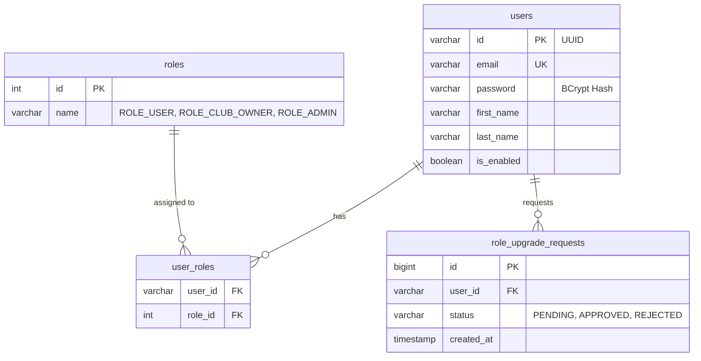

# Auth Service (Kimlik Doğrulama Servisi)

`auth-service`, UniClubConnect platformunun kullanıcı kimlik doğrulama, kayıt, e-posta doğrulama, şifreleme ve rol yönetimi süreçlerini yöneten temel Spring Boot mikroservisidir.

---

## 🏗️ Geliştirme ve Yazılım Mimarisi
Servis, geleneksel **Katmanlı Mimari (Layered Architecture)** üzerine inşa edilmiştir ve Spring Security ile entegre bir kimlik doğrulama akışı sunar.
- **Controller Katmanı**: REST uç noktalarını dış dünyaya açar ve yetkilendirme (`@PreAuthorize`) kurallarını uygular.
- **Service Katmanı**: İş mantığını barındırır. Parolaların şifrelenmesi (BCrypt), JWT token'larının üretilmesi ve RabbitMQ olaylarının fırlatılması burada gerçekleştirilir.
- **Repository Katmanı**: PostgreSQL veritabanına erişim sağlamak için Spring Data JPA arayüzlerini kullanır.
- **Güvenlik Mimarisi**: **JWT (JSON Web Token)** tabanlı stateless oturum yönetimi uygulanmıştır. Giriş işlemlerinde üretilen `Access Token` (1 saat geçerli) ve `Refresh Token` (7 gün geçerli) ile kimlik kontrolü sağlanır.

---

## 💾 Veritabanı Şeması ve Tablolar
Bu servis, ortak PostgreSQL veritabanındaki isolated **`auth_schema`** şemasını kullanmaktadır.

### Tablo İlişkileri (ERD Yapısı)

---

## ✉️ RabbitMQ Olay Akışları (Event-Driven)
Servis, gevşek bağlı (loosely coupled) entegrasyonu sağlamak için RabbitMQ üzerinden asenkron olaylar yayınlar (publish).

### 1. Yayınlanan Olaylar (Published Events)
- **Kullanıcı Kaydı (`UserCreatedEvent`)**:
  - **Exchange**: `user_exchange`
  - **Routing Key**: `user.created.key`
  - **Payload DTO**: `id`, `email`, `firstName`, `lastName`, `verificationCode`
  - **Tüketen Servisler**: 
    - `user-profile-service`: Profil kaydını otomatik başlatmak için.
    - `notification-service`: Doğrulama kodunu içeren hoş geldin e-postası göndermek için.

- **Kullanıcı Girişi (`GamificationEvent`)**:
  - **Exchange**: `gamification.exchange`
  - **Routing Key**: `gamification.event.user.login`
  - **Payload DTO**: `userId`, `eventType` (`USER_LOGIN`), `points` (örn: 10 XP)
  - **Tüketen Servisler**:
    - `gamification-service`: Kullanıcı günlük giriş streak puanını artırmak ve XP ödülü vermek için.

---

## 🔌 Servis İletişimi (OpenFeign)
`auth-service` diğer mikroservislerin kimlik doğrulama ihtiyaçları için temel teşkil ettiğinden, kendi üzerinden OpenFeign ile başka bir iç servise istek atmaz. Ancak, diğer servisler (örneğin `club-service`, `event-service` vb.) gateway üzerinden gelen isteklerdeki JWT token'ını çözümlemek için ortak kütüphaneyi kullanır.

---

## ⚙️ Yapılandırma ve Çalışma Parametreleri
- **Çalışma Portu**: `9001` (Gateway yönlendirmesi: `/api/auth/**`, `/api/requests/**`, `/api/admin/**`)
- **Veritabanı Şeması**: `auth_schema`
- **Merkezi Yapılandırma (Config Repo)**: `auth-service.yml`
- **Önemli Property Tanımları**:
  - `jwt.secret`: JWT imzalamada kullanılan 512-bit Base64 anahtarı.
  - `jwt.access-token-expiration-ms`: `3600000` (1 Saat)
  - `jwt.refresh-token-expiration-ms`: `604800000` (7 Gün)

---

## 🛣️ API Endpoint'leri (Yolları)

### 🔑 Genel Kimlik Doğrulama (Public)
| Yöntem | Endpoint | Erişim Yetkisi | Açıklama |
| :--- | :--- | :--- | :--- |
| `GET` | `/api/auth/test` | Herkese Açık | Servisin sağlık durumunu test eder. |
| `POST` | `/api/auth/register` | Herkese Açık | Yeni kullanıcı kaydı oluşturur ve `UserCreatedEvent` fırlatır. |
| `POST` | `/api/auth/login` | Herkese Açık | Kimlik bilgilerini doğrular, JWT Access ve Refresh token döner. |
| `POST` | `/api/auth/verify` | Herkese Açık | E-posta doğrulama kodunu kontrol eder ve hesabı aktifleştirir (`is_enabled = true`). |
| `POST` | `/api/auth/resend-code` | Herkese Açık | E-posta doğrulama kodunu sıfırlayıp yeniden e-posta tetikler. |

### 📋 Rol Yükseltme Talepleri (Kullanıcı)
| Yöntem | Endpoint | Erişim Yetkisi | Açıklama |
| :--- | :--- | :--- | :--- |
| `POST` | `/api/requests/club-owner-role` | `ROLE_USER` | Kulüp yöneticisi (`CLUB_OWNER`) olmak için başvuru talebi oluşturur. |
| `GET` | `/api/requests/my-status` | Giriş Yapmış Kullanıcı | Mevcut kullanıcının yaptığı son rol yükseltme talebini ve durumunu sorgular. |

### 🛠️ Admin Yönetimi (Admin Only)
| Yöntem | Endpoint | Erişim Yetkisi | Açıklama |
| :--- | :--- | :--- | :--- |
| `GET` | `/api/admin/role-requests/pending` | `ROLE_ADMIN` | Beklemede olan tüm (`PENDING`) rol yükseltme taleplerini listeler. |
| `POST` | `/api/admin/role-requests/{requestId}/approve` | `ROLE_ADMIN` | Rol talebini onaylar, kullanıcının rollerine `ROLE_CLUB_OWNER` ekler. |
| `POST` | `/api/admin/role-requests/{requestId}/reject` | `ROLE_ADMIN` | Belirtilen rol talebini reddeder. |
