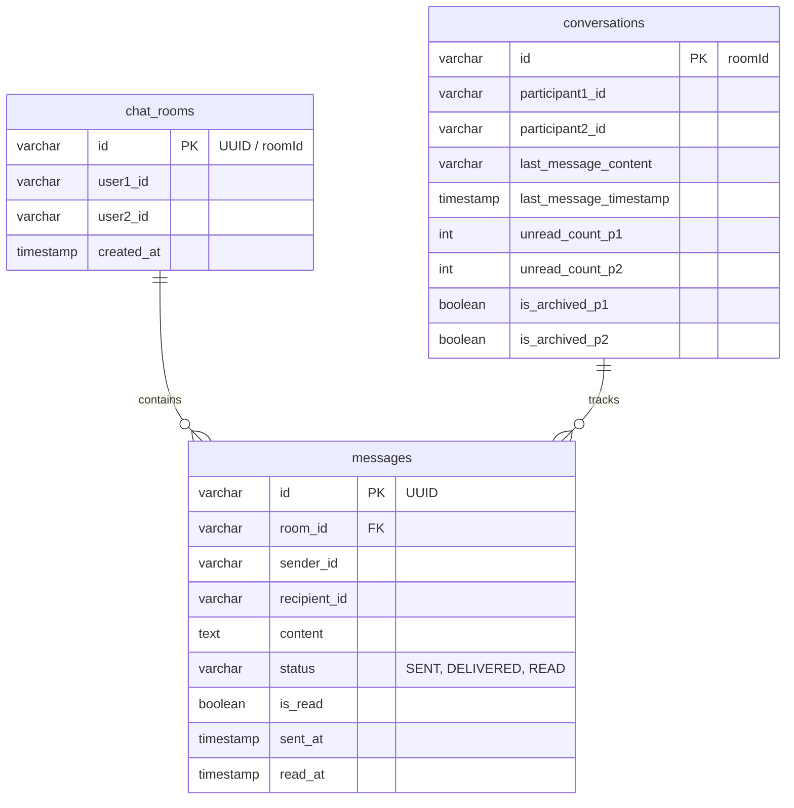

# Chat Service (Mesajlaşma Servisi)

`chat-service`, UniClubConnect platformundaki kullanıcılar arasında birebir, gerçek zamanlı (WebSocket) ve geçmişe dönük (REST) mesajlaşmayı sağlayan yüksek performanslı Spring Boot mikroservisidir.

---

## 🏗️ Geliştirme ve Yazılım Mimarisi
Servis, asenkron ve gerçek zamanlı iletişimi bir arada sunmak için **Olay-Odaklı (Event-Driven) ve WebSocket tabanlı** bir mimari kullanır.
- **WebSocket STOMP Protokolü**: Kullanıcılar arasındaki anlık mesaj iletimi, yazıyor bilgisi ve durum güncellemeleri WebSocket üzerinden gerçekleştirilir. `/app` prefixi ile sunucuya yönlendirilen istekler, `/user/queue/...` üzerinden kullanıcıya özel olarak dağıtılır.
- **Redis Online Presence Tracking**: Kullanıcıların anlık çevrimiçi/çevrimdışı durumları Redis (`online:user:<userId>`) üzerinde tutulur.
  - Bir mesaj geldiğinde alıcı **online** ise mesaj doğrudan WebSocket kanalıyla iletilir.
  - Alıcı **offline** ise mesaj veritabanına yazıldıktan sonra RabbitMQ (`notification_exchange` -> `unread.message`) üzerinden bildirim kuyruğuna asenkron bir olay fırlatılarak kullanıcının e-posta ile uyarılması sağlanır.
- **Gecikmeli Okunmamış Sayacı & Inbox Senkronizasyonu**: `Message` ve `Conversation` tabloları birbirleriyle senkronize çalışarak hem tekil mesaj bazlı okunma (`isRead`) hem de oda bazlı toplam okunmamış sayacı yönetimini sağlar.

---

## 💾 Veritabanı Şeması ve Tablolar
Bu servis, ortak PostgreSQL veritabanındaki isolated **`chat_schema`** şemasını kullanmaktadır.

### Tablo İlişkileri (ERD Yapısı)

---

## ✉️ RabbitMQ Olay Akışları (Event-Driven)
Servis, çevrimdışı mesaj bildirimlerini tetiklemek için RabbitMQ üzerinden olay yayınlar.

### 1. Yayınlanan Olaylar (Published Events)
- **Çevrimdışı Mesaj Bildirimi (`UnreadMessageEvent`)**:
  - **Exchange**: `notification_exchange`
  - **Routing Key**: `unread.message`
  - **Payload DTO**: `messageId`, `recipientId`
  - **Tüketen Servisler**:
    - `notification-service`: Alıcıya "Yeni bir okunmamış mesajınız var!" e-postası göndermek için.

---

## 🔌 Servis İletişimi (OpenFeign)
`chat-service` şu an için diğer iç servislerle FeignClient üzerinden doğrudan senkronize iletişim kurmamaktadır. Kimlik doğrulama işlemi API Gateway seviyesinde çözülerek JWT içindeki kullanıcı bilgileri (`UserPrincipal`) `Principal` nesnesi aracılığıyla controller metotlarına iletilir.

---

## ⚙️ Yapılandırma ve Çalışma Parametreleri
- **Çalışma Portu**: `9012` (Gateway yönlendirmesi: `/api/chat/**` [HTTP], `/ws/**` [WebSocket])
- **Veritabanı Şeması**: `chat_schema`
- **Merkezi Yapılandırma (Config Repo)**: `chat-service.yml`
- **Gerekli Altyapı**:
  - **Redis**: Port `6379` (Çevrimiçi takibi için)
  - **RabbitMQ**: Port `5672` (Çevrimdışı bildirimleri için)

---

## 🛣️ API ve WebSocket Protokol Yolları

### 🔌 WebSocket Mesaj Kanalları (STOMP)
WebSocket Bağlantı Noktası: `ws://localhost:8080/ws` (API Gateway Üzerinden)

| Hedef Kanal (Destination) | Payload (Veri Yapısı) | Açıklama |
| :--- | :--- | :--- |
| `/app/chat.send` | `ChatMessageRequest` | Karşı tarafa yeni bir mesaj gönderir. Alıcı offline ise RabbitMQ tetikler. |
| `/app/chat.status` | `{"messageId", "senderId", "status"}` | Mesajın durumunu günceller (`DELIVERED`, `READ`) ve gönderene bildirir. |
| `/app/chat.typing` | `{"recipientId", "isTyping"}` | "Yazıyor..." animasyonunu anlık olarak tetikler. |
| `/app/chat.delete` | `{"messageId"}` | Belli bir mesajı gerçek zamanlı olarak siler. |
| `/app/chat.edit` | `EditMessageRequest` | Gönderilen bir mesajı gerçek zamanlı olarak günceller. |
| `/app/chat.mark-read` | `{"messageId", "senderId"}` | Gelen tekil mesajı okundu işaretler ve gelen kutusu sayacını günceller. |

---

### 📂 REST API Endpoint'leri

#### 💬 Sohbet Geçmişi ve Arama
| Yöntem | Endpoint | Erişim Yetkisi | Açıklama |
| :--- | :--- | :--- | :--- |
| `GET` | `/api/chat/history/{recipientId}` | Giriş Yapmış Kullanıcı | Belirtilen kullanıcıyla olan mesaj geçmişini sayfa sayfa getirir (`?page=0&size=50`). |
| `GET` | `/api/chat/search` | Giriş Yapmış Kullanıcı | Belirli bir odadaki mesajlarda kelime araması yapar (`?recipientId=...&q=...`). |
| `GET` | `/api/chat/search-all` | Giriş Yapmış Kullanıcı | Kullanıcının tüm sohbetlerindeki mesajlarda global arama yapar (`?q=...`). |
| `GET` | `/api/chat/search/{partnerId}` | Giriş Yapmış Kullanıcı | Belirtilen partner ile olan konuşmada arama yapar (`?q=...`). |

#### 📥 Gelen Kutusu (Conversations / Inbox) Yönetimi
| Yöntem | Endpoint | Erişim Yetkisi | Açıklama |
| :--- | :--- | :--- | :--- |
| `GET` | `/api/chat/conversations` | Giriş Yapmış Kullanıcı | Kullanıcının aktif sohbet (inbox) listesini son mesaj detaylarıyla getirir. |
| `GET` | `/api/chat/conversations/archived` | Giriş Yapmış Kullanıcı | Arşivlenmiş konuşmaları listeler. |
| `GET` | `/api/chat/conversations/unread` | Giriş Yapmış Kullanıcı | Sadece okunmamış mesaj barındıran konuşmaları listeler. |
| `POST` | `/api/chat/conversations/{conversationId}/mark-read` | Giriş Yapmış Kullanıcı | Bütün bir sohbeti okundu olarak işaretler ve sayacı sıfırlar. |
| `POST` | `/api/chat/conversations/{conversationId}/archive` | Giriş Yapmış Kullanıcı | Sohbeti arşiv listesine taşır (aktif listeden gizler). |
| `POST` | `/api/chat/conversations/{conversationId}/unarchive` | Giriş Yapmış Kullanıcı | Sohbeti arşivden aktif gelen kutusuna geri taşır. |

#### 🔢 Okunmamış Sayacı & Mesaj İşlemleri
| Yöntem | Endpoint | Erişim Yetkisi | Açıklama |
| :--- | :--- | :--- | :--- |
| `GET` | `/api/chat/unread-count` | Giriş Yapmış Kullanıcı | Kullanıcının tüm odalardaki toplam okunmamış mesaj sayısını döner. |
| `GET` | `/api/chat/unread-count/{recipientId}` | Giriş Yapmış Kullanıcı | Sadece belirli bir kullanıcıdan gelen okunmamış mesaj sayısını döner. |
| `POST` | `/api/chat/mark-read/{recipientId}` | Giriş Yapmış Kullanıcı | Belirtilen kullanıcıyla olan tüm sohbeti okundu işaretler ve sayaçları sıfırlar. |
| `POST` | `/api/chat/mark-all-read` | Giriş Yapmış Kullanıcı | Tüm konuşmaları okundu olarak işaretler. |
| `PUT` | `/api/chat/messages/{messageId}` | Giriş Yapmış Kullanıcı | Gönderilen mesaj içeriğini günceller (REST API). |
| `DELETE` | `/api/chat/messages/{messageId}` | Giriş Yapmış Kullanıcı | Gönderilen mesajı veritabanından tamamen siler (REST API). |
