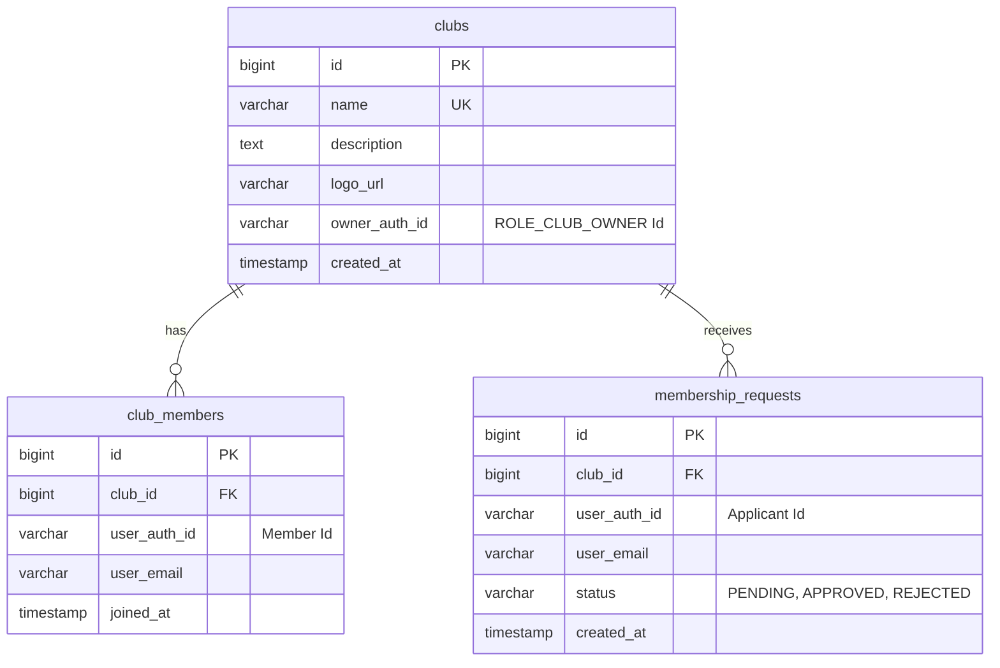

# Club Service (Kulüp Yönetim Servisi)

`club-service`, platformdaki öğrenci kulüplerinin oluşturulması, güncellenmesi, logolarının MinIO üzerinde saklanması, üyelik başvurularının yönetilmesi ve üye listelerinin idare edilmesini sağlayan Spring Boot mikroservisidir.

---

## 🏗️ Geliştirme ve Yazılım Mimarisi
Servis, geleneksel **Katmanlı Mimari (Layered Architecture)** kullanmaktadır.
- **Güvenlik Mimarisi**: JWT tabanlı kimlik doğrulama API Gateway seviyesinde çözülerek `UserPrincipal` olarak controller metotlarına enjekte edilir. Kulüp bazlı sahiplik kontrolleri (`@PreAuthorize`) için özel bir `ClubSecurityService` sınıfı (`@clubSecurity.isOwner(#principal, #clubId)`) devrededir.
- **Medya Depolama (Object Storage)**: Kulüp logoları, S3 uyumlu **MinIO** nesne depolama sunucusunda saklanır. MinIO client SDK doğrudan entegre edilmiştir.
- **Olay Odaklı Yapı (Event-Driven)**: Kulüp üyelik istekleri onaylandığında veya bir kullanıcı kulübe doğrudan katıldığında, RabbitMQ üzerinden puanlama motorunu tetikleyecek asenkron olaylar yayınlanır.

---

## 💾 Veritabanı Şeması ve Tablolar
Bu servis, ortak PostgreSQL veritabanındaki isolated **`club_schema`** şemasını kullanmaktadır.

### Tablo İlişkileri (ERD Yapısı)

---

## ✉️ RabbitMQ Olay Akışları (Event-Driven)
Kulüp katılımlarını ödüllendirmek amacıyla asenkron olaylar yayınlanır.

### 1. Yayınlanan Olaylar (Published Events)
- **Kullanıcı Kulübe Katıldı (`UserJoinedClubEvent`)**:
  - **Exchange**: `club_exchange`
  - **Routing Key**: `user.joined.club.key`
  - **Payload DTO**: `userAuthId`, `clubId`, `clubName`
  - **Tüketen Servisler**:
    - `gamification-service`: Kullanıcıya kulübe katılımından dolayı XP ödülü vermek için.

---

## 🔌 Servis İletişimi (OpenFeign)
`club-service` diğer mikroservislerden gelen iç sorgulara FeignClient arayüzü sağlar.

### 1. Sağlanan Endpoint'ler (Exposed to Feign)
- **Sahiplik Sorgulama API'si (`GET /api/clubs/{clubId}/is-owner/{authId}`)**:
  - **Tüketen Servisler**: `event-service` (Etkinlik oluşturulurken, oluşturan kişinin kulüp sahibi olup olmadığını doğrulamak için bu uç noktayı çağırır).

---

## ⚙️ Yapılandırma ve Çalışma Parametreleri
- **Çalışma Portu**: `9003` (Gateway yönlendirmesi: `/api/clubs/**`)
- **Veritabanı Şeması**: `club_schema`
- **Merkezi Yapılandırma (Config Repo)**: `club-service.yml`
- **Depolama S3/MinIO Yapılandırması**:
  - `minio.url`: `http://localhost:9000`
  - `minio.bucketName`: `uniclub-logos`
  - `minio.accessKey` / `secretKey`: `minioadmin`

---

## 🛣️ API Endpoint'leri (Yolları)

### 📢 Kulüp Bilgi ve Keşif İşlemleri (Public)
| Yöntem | Endpoint | Erişim Yetkisi | Açıklama |
| :--- | :--- | :--- | :--- |
| `GET` | `/api/clubs` | Herkese Açık | Sistemdeki tüm aktif kulüpleri listeler. |
| `GET` | `/api/clubs/{clubId}` | Herkese Açık | ID'si verilen kulübün detay bilgilerini getirir. |
| `GET` | `/api/clubs/search` | Herkese Açık | Kulüp isimlerine göre arama yapar (`?query=...`). |
| `GET` | `/api/clubs/{clubId}/is-owner/{authId}` | **İç Servis (Feign)** | Belirtilen kullanıcının kulübün sahibi olup olmadığını kontrol eder. |

### 🛠️ Kulüp Yönetim İşlemleri (Club Owner)
| Yöntem | Endpoint | Erişim Yetkisi | Açıklama |
| :--- | :--- | :--- | :--- |
| `POST` | `/api/clubs` | `ROLE_CLUB_OWNER` | Yeni bir kulüp oluşturur ve sahibini tanımlar. |
| `GET` | `/api/clubs/my-club` | `ROLE_CLUB_OWNER` | Giriş yapmış kulüp yöneticisinin kendi kulüp bilgilerini getirir. |
| `PUT` | `/api/clubs/{clubId}` | `ROLE_CLUB_OWNER` *(Kulüp Sahibi)* | Kulüp açıklamasını ve başlığını günceller. |
| `POST` | `/api/clubs/{clubId}/logo` | `ROLE_CLUB_OWNER` *(Kulüp Sahibi)* | Kulübe yeni bir logo yükler, MinIO'ya yükleyip URL'ini veritabanında günceller. |

### 👥 Kulüp Üyelik ve Başvuru İşlemleri (User & Club Owner)
| Yöntem | Endpoint | Erişim Yetkisi | Açıklama |
| :--- | :--- | :--- | :--- |
| `POST` | `/api/clubs/{clubId}/join` | `ROLE_USER` | Kulübe üye olmak için başvuru (katılım isteği) gönderir. |
| `DELETE` | `/api/clubs/{clubId}/leave` | `ROLE_USER` | Kullanıcının üye olduğu kulüpten kendi isteğiyle ayrılmasını sağlar. |
| `GET` | `/api/clubs/{clubId}/requests` | `ROLE_CLUB_OWNER` *(Kulüp Sahibi)* | Kulübe yapılmış beklemedeki (`PENDING`) üyelik başvurularını listeler. |
| `POST` | `/api/clubs/requests/{requestId}/approve` | `ROLE_CLUB_OWNER` | Üyelik başvurusunu onaylar, kullanıcıyı kulübe üye yapar ve `UserJoinedClubEvent` yayınlar. |
| `POST` | `/api/clubs/requests/{requestId}/reject` | `ROLE_CLUB_OWNER` | Üyelik başvurusunu reddeder. |
| `GET` | `/api/clubs/{clubId}/members` | `ROLE_CLUB_OWNER` *(Kulüp Sahibi)* | Kulübe kayıtlı mevcut üyelerin listesini getirir. |
| `DELETE` | `/api/clubs/{clubId}/members/{memberAuthId}` | `ROLE_CLUB_OWNER` *(Kulüp Sahibi)* | Belirtilen üyeyi kulüpten çıkartır (Kicking). |
