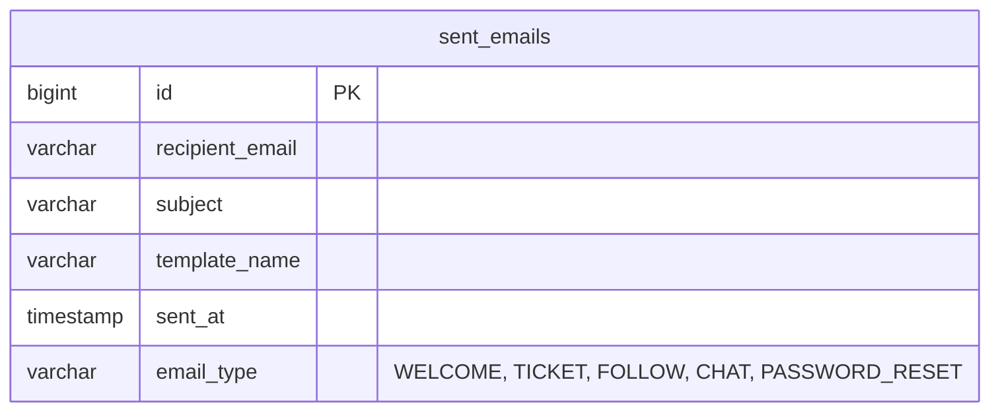

# Notification Service (Bildirim ve E-posta Servisi)

`notification-service`, UniClubConnect platformundaki tüm asenkron e-posta bildirim süreçlerini yöneten Spring Boot mikroservisidir. Dış dünyaya açık hiçbir REST API barındırmaz; tamamen asenkron, olay-odaklı (event-driven) çalışarak RabbitMQ üzerinden gelen etkileşimleri tüketir (consume) ve e-postaya dönüştürür.

---

## 🏗️ Geliştirme ve Yazılım Mimarisi
Servis, mikroservislerin gevşek bağlı (decoupled) ve arka planda çalışabilir olması için **Event Consumer (Olay Tüketici)** modeline göre tasarlanmıştır.
- **Thymeleaf HTML Şablon Motoru**: Gönderilen tüm e-postalar zengin içerikli dinamik HTML şablonları (`templates/...`) kullanılarak hazırlanır. E-postaların içine QR kod bağlantıları, doğrulama kodları ve kullanıcı isimleri dinamik olarak enjekte edilir.
- **Mailpit SMTP Entegrasyonu**: Geliştirme ortamında maillerin gerçek sunuculara gitmesini engellemek ve kolayca izlemek amacıyla Docker tabanlı **Mailpit SMTP** sunucusu (Port: `1025`) entegre edilmiştir.
- **Denetim Günlüğü (Audit Log)**: Gönderilen her başarılı veya başarısız e-posta, geçmişe yönelik kontrol amacıyla veritabanındaki `sent_emails` tablosuna loglanır.
- **Kimlik Çözümleme Katmanı**: RabbitMQ olaylarında performans için sadece UUID/ID bilgileri taşınır. Servis, e-postayı göndermeden önce `user-profile-service` FeignClient arayüzünü arayarak alıcının e-posta adresini ve adını dinamik olarak çözümler.

---

## 💾 Veritabanı Şeması ve Tablolar
Bu servis, ortak PostgreSQL veritabanındaki isolated **`notification_schema`** şemasını kullanmaktadır.

### Tablo Yapısı

---

## ✉️ RabbitMQ Dinleyicileri (Listeners) & Olaylar
Servis, asenkron olarak aşağıdaki kuyrukları dinler (subscribe) ve ilgili olayları tüketir.

| Dinlenen Kuyruk (Queue) | Bağlı Exchange | Routing Key (Yönlendirme) | Tüketilen Event Sınıfı | E-posta Şablonu | Açıklama |
| :--- | :--- | :--- | :--- | :--- | :--- |
| `notification_welcome_email_queue` | `user_exchange` | `user.created.key` | `UserCreatedEvent` | `welcome-template` | Yeni kaydolan kullanıcılara doğrulama kodu ve hoş geldin mesajı gönderir. |
| `notification_ticket_email_queue` | `notification_exchange` | `ticket.created.key` | `TicketCreatedEvent` | `ticket-template` | Kaydolunan etkinliğin detaylarını ve kapıda okutulacak bilet kodlu QR bağlantısını içerir. |
| `notification_follow_email_queue` | `follow.exchange` | `follow.created` | `FollowEvent` | `follow-request-template`   `follow-accepted-template` | Profil gizliyken gelen takip isteklerini veya istek kabul edildiğinde takip edene bildirim e-postası atar. |
| `notification_chat_message_queue` | `notification_exchange` | `unread.message` | `UnreadMessageEvent` | `chat-notification-template` | Kullanıcı çevrimdışıyken gelen mesajları e-posta kutusuna önizleme olarak yollar. |
| `notification_password_reset_queue` | `notification_exchange` | `user.reset.key` | `PasswordResetEvent` | `password-reset-template` | Parolasını sıfırlamak isteyen kullanıcılara sıfırlama kodu gönderir. |

---

## 🔌 Servis İletişimi (OpenFeign)
Servis, kuyruktan aldığı olaylarda sadece ham kullanıcı ID'leri bulunduğundan, ad/soyad ve e-posta bilgilerini çekmek için senkron FeignClient bağlantısı kurar.

### 1. Tüketilen Dış Servisler (Feign Clients)
- **`ProfileServiceClient` (`user-profile-service` çağrılır)**:
  - **Uç Nokta (`GET /api/profiles/user/{authId}`)**: Takip bildirimleri ve okunmamış mesaj mailleri tetiklendiğinde, ID'lere karşılık gelen kullanıcıların e-posta adreslerini ve isimlerini çözmek amacıyla çağrılır.

---

## ⚙️ Yapılandırma ve Çalışma Parametreleri
- **Çalışma Portu**: `9006` (Gateway yönlendirmesi yoktur; dışarıya REST API açmaz).
- **Veritabanı Şeması**: `notification_schema`
- **Merkezi Yapılandırma (Config Repo)**: `notification-service.yml`
- **Mail Gönderim (SMTP) Ayarları**:
  - `spring.mail.host`: `localhost`
  - `spring.mail.port`: `1025` (Mailpit SMTP)
  - `spring.mail.properties.mail.smtp.auth`: `false`
