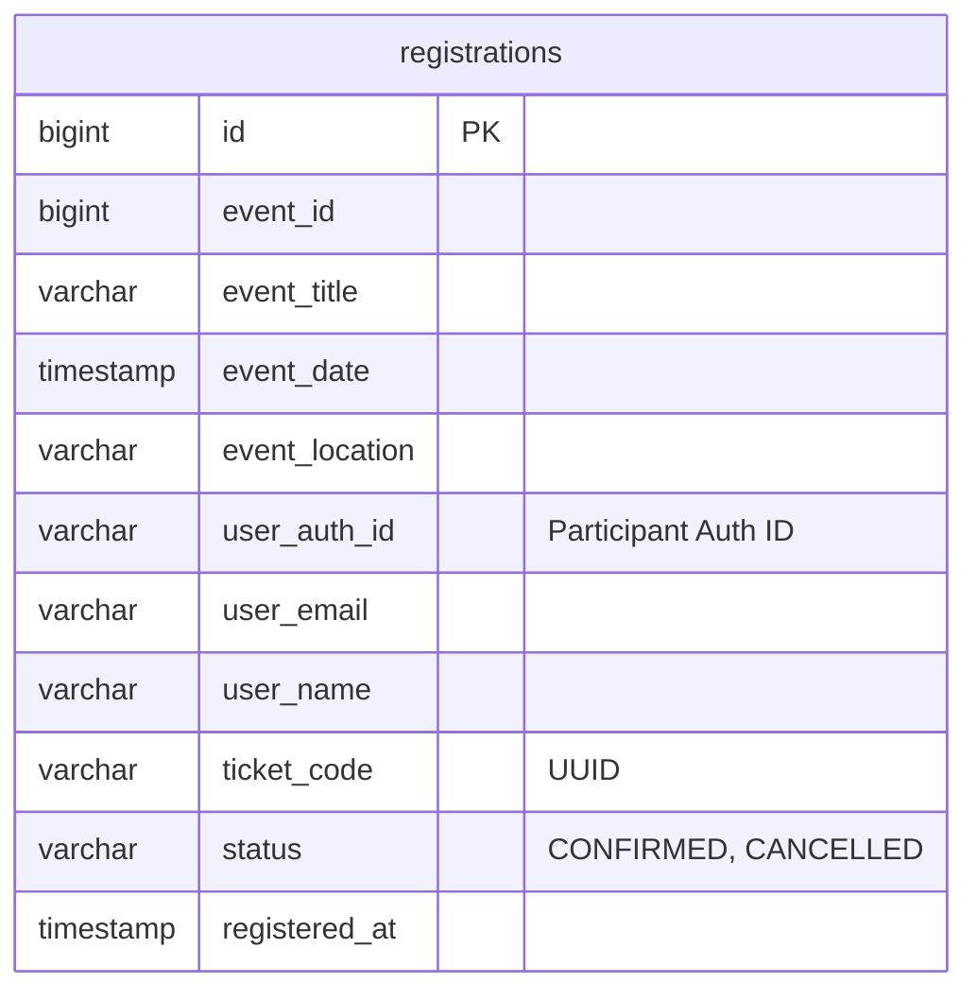

# Registration Service (Etkinlik Kayıt ve Bilet Servisi)

`registration-service`, platformdaki etkinliklere kayıt olma, bilet tanımlama, bilet iptalleri ve etkinlik girişlerinde bilet kodlarının/QR kodlarının doğrulanması süreçlerini yöneten Spring Boot mikroservisidir.

---

## 🏗️ Geliştirme ve Yazılım Mimarisi
Servis, yüksek eşzamanlı (high concurrency) bilet satış taleplerini güvenli yönetmek için **Bellek-İçi Atomik Dağıtılmış Kilit (Distributed In-Memory Lock) / Kontenjan Kontrolü** ve **Olay-Odaklı (Event-Driven)** mimariyi bir arada kullanır.
- **Yüksek Concurrency Güvenli Kontenjan Yönetimi (Redis)**: Klasik SQL veritabanı üzerinden `select count(*)` ve ardından `insert` yapmak, bilet kapışmalarında (race condition) aşırı yükte veritabanının tıkanmasına ve kontenjanın aşılmasına yol açar. Servis bu problemi şu şekilde çözer:
  1. `event-service` üzerinde tanımlanan kontenjan Redis'te `"event:<eventId>:quota"` anahtarına yazılır.
  2. Kayıt anında Redis üzerinden atomik azaltma işlemi (`redisTemplate.opsForValue().decrement(redisKey)`) uygulanır.
  3. Dönen değer `< 0` ise kontenjan dolmuş kabul edilir, anında kilit geri artırılır (`increment`) ve işlem hata fırlatılarak iptal edilir. Bu sayede veritabanına tek bir kilit sorgusu gitmeden nanosaniyeler düzeyinde kontenjan kontrolü tamamlanır.
- **QR ve Bilet Doğrulama**: Kayıt onaylandığında benzersiz bir `UUID` bilet kodu oluşturulur. Kapıda bilet kontrolü esnasında, kulüp yöneticisi tarafından bilet doğrulama tetiklendiğinde sistem bilet durumunu kontrol eder ve `Event Service` FeignClient arayüzü ile sahiplik doğrulaması yaparak geçiş izni verir (`validateTicket`).
- **Asenkron Olay Bildirimi**:
  - E-Posta Tetikleyicisi: Bilet başarıyla basıldığında, RabbitMQ (`notification_exchange` -> `ticket.created.key`) üzerinden e-posta servisine asenkron bilet bilgileri fırlatılır.
  - Oyunlaştırma Tetikleyicisi: Bilet alımı sonrasında asenkron `GamificationEvent` (`EVENT_JOINED`) fırlatılarak kullanıcının XP kazanması sağlanır.

---

## 💾 Veritabanı Şeması ve Tablolar
Bu servis, ortak PostgreSQL veritabanındaki isolated **`registration_schema`** şemasını kullanmaktadır.

### Tablo Yapısı

---

## ✉️ RabbitMQ Olay Akışları (Event-Driven)
Bilet alım işlemlerinde sistemi bilgilendirmek amacıyla asenkron olaylar yayınlanır.

### 1. Yayınlanan Olaylar (Published Events)
- **Bilet Oluşturuldu (`TicketCreatedEvent`)**:
  - **Exchange**: `notification_exchange` (Varsayılan)
  - **Routing Key**: `ticket.created.key` (Varsayılan)
  - **Payload DTO**: `email`, `userName`, `eventTitle`, `ticketCode`, `eventDate`, `location`
  - **Tüketen Servisler**:
    - `notification-service`: Alıcıya QR kodlu ve detaylı bilet PDF'ini/e-postasını yollamak için.

- **Bilet Etkinlik Katılımı Ödülü (`GamificationEvent`)**:
  - **Exchange**: `gamification.exchange` (Varsayılan)
  - **Routing Key**: `gamification.event.event` (Varsayılan)
  - **Payload DTO**: `userId`, `eventType` (`EVENT_JOINED`), `referenceId` (Etkinlik ID), `timestamp`
  - **Tüketen Servisler**:
    - `gamification-service`: Kullanıcıya etkinliğe katıldığı için XP puanı vermek ve rozet kurallarını işletmek için.

---

## 🔌 Servis İletişimi (OpenFeign)
Servis, etkinlik doğrulaması ve yetkilendirme kontrolleri için senkron FeignClient bağlantısı kurar.

### 1. Tüketilen Dış Servisler (Feign Clients)
- **`EventServiceClient` (`event-service` çağrılır)**:
  - **Detay Getirme (`GET /api/events/{id}`)**: Kaydolunacak veya doğrulanacak etkinliğin var olup olmadığını kontrol etmek, toplam kontenjan durumunu öğrenmek ve bilet doğrulayan kişinin o etkinliği düzenleyen kulübün sahibi (`organizerAuthId`) olup olmadığını teyit etmek için çağrılır.

---

## ⚙️ Yapılandırma ve Çalışma Parametreleri
- **Çalışma Portu**: `9005` (Gateway yönlendirmesi: `/api/registrations/**`)
- **Veritabanı Şeması**: `registration_schema`
- **Merkezi Yapılandırma (Config Repo)**: `registration-service.yml`
- **RabbitMQ Yayınlama Yapılandırması**:
  - `spring.rabbitmq.exchange.name`: `notification_exchange`
  - `spring.rabbitmq.routingkey.ticket_created`: `ticket.created.key`
  - `gamification.rabbitmq.exchange`: `gamification.exchange`
  - `gamification.rabbitmq.routing-key`: `gamification.event.event`
- **Önbellek (Redis)**: Kontenjan sorgulamaları için `localhost:6379` adresi üzerinden Redis bağlantısı kurulur.

---

## 🛣️ API Endpoint'leri (Yolları)

### 🎫 Kullanıcı Bilet İşlemleri (User)
| Yöntem | Endpoint | Erişim Yetkisi | Açıklama |
| :--- | :--- | :--- | :--- |
| `POST` | `/api/registrations/{eventId}` | `ROLE_USER` | Belirtilen etkinliğe bilet alır. Redis üzerinden kontenjan düşürülür, RabbitMQ bildirimleri tetiklenir. |
| `GET` | `/api/registrations/my-tickets` | `ROLE_USER` | Giriş yapmış kullanıcının sahip olduğu tüm aktif biletleri listeler. |
| `DELETE` | `/api/registrations/{ticketCode}` | `ROLE_USER` | Kullanıcının kendi biletini iptal etmesini sağlar. Redis kontenjanı 1 artırılır. |

### 🔍 Kulüp Sahibi ve Bilet Doğrulama İşlemleri (Club Owner)
| Yöntem | Endpoint | Erişim Yetkisi | Açıklama |
| :--- | :--- | :--- | :--- |
| `GET` | `/api/registrations/event/{eventId}` | `ROLE_CLUB_OWNER` | Belirli bir etkinliğe kayıt olan tüm katılımcı listesini getirir. *(Sadece etkinliği düzenleyen kulüp sahibi erişebilir)* |
| `POST` | `/api/registrations/validate/{ticketCode}` | `ROLE_CLUB_OWNER` | Giriş kapısında bilet kodunun geçerliliğini, kullanılma durumunu ve sahipliğini doğrular. |
